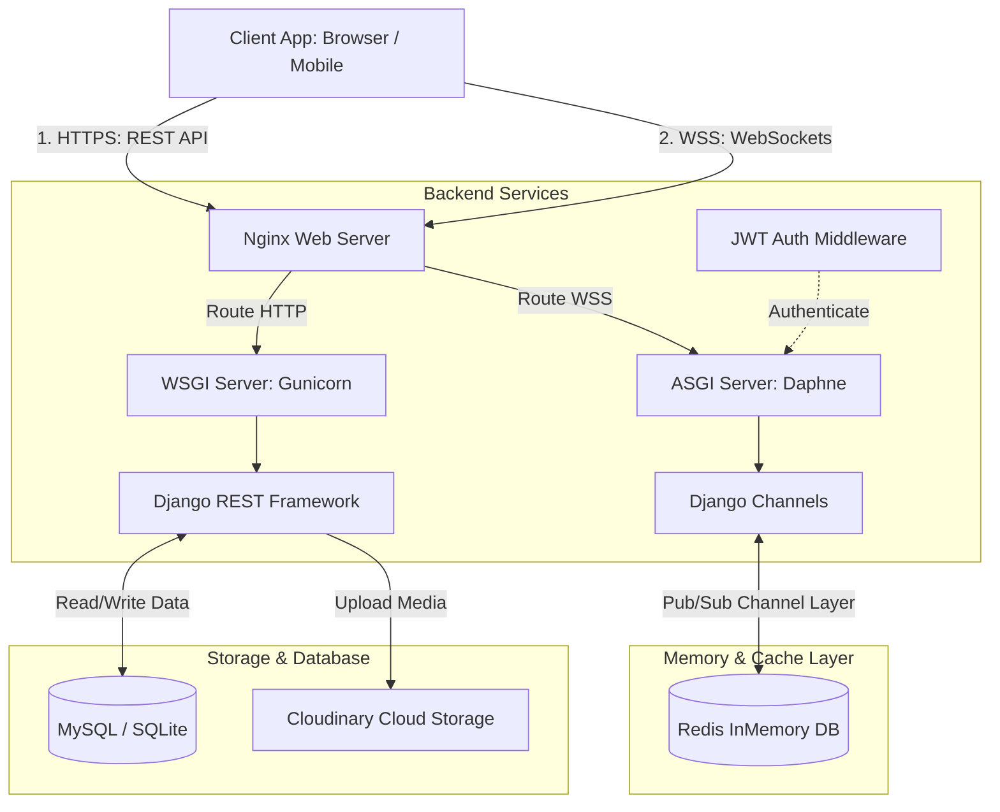
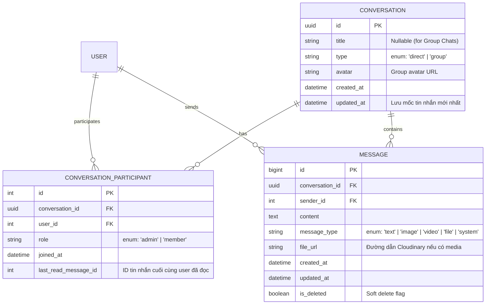

# LinkSphere - Real-time Social Network Backend API 🌐

[](https://www.djangoproject.com/)
[](https://www.django-rest-framework.org/)
[](https://www.python.org/)
[](https://github.com/django/daphne)
[](https://pytest.org/)
[](https://opensource.org/licenses/MIT)

**LinkSphere** là hệ thống Backend API hiệu năng cao cho mạng xã hội thu nhỏ, cho phép người dùng kết nối, chia sẻ bài viết, tương tác thời gian thực và trò chuyện tức thì. Dự án được phát triển chuyên nghiệp bằng cách phân rã module thành các ứng dụng Django độc lập, kết hợp hoàn hảo giữa giao thức RESTful API và giao tiếp thời gian thực hai chiều WebSockets (ASGI).

---

## 📌 Mục Lục
* [⚡ Các Tính Năng Nổi Bật](#-các-tính-năng-nổi-bật)
* [🏗️ Kiến Trúc Hệ Thống & Công Nghệ](#️-kiến-trúc-hệ-thống--công-nghệ)
* [💾 Thiết Kế Mô Hình Cơ Sở Dữ Liệu (Database Schema)](#-thiết-kế-mô-hình-cơ-sở-dữ-liệu-database-schema)
* [⚡ Định Dạng API Response Chuẩn Hóa](#-định-dạng-api-response-chuẩn-hóa)
* [🛠️ Hướng Dẫn Cài Đặt Local & Chạy Thử](#️-hướng-dẫn-cài-đặt-local--chạy-thử)
* [🧪 Hướng Dẫn Chạy Toàn Bộ Test Suite](#-hướng-dẫn-chạy-toàn-bộ-test-suite)
* [📡 Đặc Tả Giao Thức WebSockets Chat](#-đặc-tả-giao-thức-websockets-chat)
* [🤝 Đóng Góp & Bản Quyền](#-đóng-góp--bản-quyền)

---

## ⚡ Các Tính Năng Nổi Bật

Hệ thống được thiết kế theo cấu trúc mô-đun hóa cao độ (Modular Architecture) chia thành các ứng dụng Django độc lập nằm trong thư mục `apps/`:

*   **Xác thực & Người dùng (`apps.users`)**: Đăng ký, Đăng nhập bảo mật sử dụng cơ chế cặp mã thông báo **JWT (Access & Refresh Token)**, xem/cập nhật thông tin cá nhân và tính năng Theo dõi / Bỏ theo dõi (Follow / Unfollow).
*   **Bài viết (`apps.posts`)**: Tạo bài viết mới kèm hình ảnh tải lên đám mây, danh sách bài viết trên dòng thời gian và tính năng Thích bài viết (Liking / Unliking).
*   **Bình luận (`apps.comments`)**: Bình luận đa cấp dưới các bài viết.
*   **Bảng tin (`apps.feed`)**: 
    *   `Feed`: Chỉ hiển thị các bài viết từ những người mà người dùng hiện tại đang theo dõi (sắp xếp theo thời gian).
    *   `Explore`: Hiển thị tất cả các bài viết công khai để khám phá nội dung mới.
*   **Hộp thư thông báo (`apps.notifications`)**: Tự động tạo thông báo đẩy một chiều thời gian thực (qua WebSockets) khi có tương tác mới (thích bài viết, bình luận, được theo dõi). Hỗ trợ đánh dấu đã đọc.
*   **Tìm kiếm thông tin (`apps.search`)**: Truy vấn tìm kiếm thông minh người dùng và bài viết.
*   **Chat thời gian thực (`apps.chat`)** *(Tính năng mới tích hợp)*:
    *   Trò chuyện 1-đối-1 (Direct Chat) và trò chuyện nhóm (Group Chat).
    *   Tự động tìm kiếm và tái sử dụng phòng chat 1-đối-1 cũ để tối ưu hóa tài nguyên.
    *   **WebSockets Real-time**: Gửi/nhận tin nhắn tức thì, trạng thái đang nhập chữ (*typing indicator*) và trạng thái đã đọc (*read receipt*).
    *   Phân trang lịch sử tin nhắn dạng **Cursor-based Pagination** tối ưu chống trùng lặp dữ liệu khi cuộn.
    *   Tải ảnh/video/tệp tin đính kèm trực tiếp lên **Cloudinary CDN** thông qua API.

---

## 🏗️ Kiến Trúc Hệ Thống & Công Nghệ



### Chi tiết các công nghệ cốt lõi:
*   **Backend Framework:** Django & Django REST Framework (DRF).
*   **Real-time engine:** Django Channels, giao thức ASGI chạy bằng Daphne Server.
*   **Channel Layer:** Sử dụng **Redis** (`channels_redis`) làm trung gian phân phát tin nhắn bất đồng bộ.
*   **Dịch vụ đám mây (Cloud Services):**
    *   **Cloudinary Storage:** Lưu trữ và phục vụ CDN hình ảnh bài viết và avatar.
    *   **Resend API:** Tự động gửi email xác thực và chào mừng thành viên mới đăng ký.
*   **Testing:** Pytest & Pytest-Django giúp tự động hóa quá trình chạy kiểm thử.

---

## 💾 Thiết Kế Mô Hình Cơ Sở Dữ Liệu (Database Schema)

Để hỗ trợ tính năng chat nhóm và tối ưu hóa tốc độ truy vấn, mô hình dữ liệu Chat được cấu trúc chuẩn hóa:



> [!TIP]
> **Tối ưu hóa Database Index:**
> *   Đặt **Composite Index** trên bảng `CONVERSATION_PARTICIPANT` ở cặp `(user_id, conversation_id)` giúp kiểm tra quyền truy cập phòng chat trong vòng vài phần nghìn giây.
> *   Đặt **Composite Index** trên bảng `MESSAGE` ở cặp `(conversation_id, id)` để tối ưu hóa việc phân trang lấy lịch sử tin nhắn của cuộc trò chuyện theo thứ tự giảm dần mà không cần sắp xếp lại trên bộ nhớ tạm.

---

## ⚡ Định Dạng API Response Chuẩn Hóa

Toàn bộ các phản hồi API của hệ thống đều được wrap qua một lớp middleware/handler để đảm bảo cấu trúc JSON trả về Frontend luôn đồng nhất:

### Phản hồi Thành Công (Success Response)
```json
{
    "success": true,
    "message": "Create direct chat successfully.",
    "data": {
        "id": "a0831845-43b5-4f43-b19b-ebecc3081bf1",
        "title": "testuser",
        "type": "direct",
        "avatar": null,
        "created_at": "2026-05-31T03:00:00Z",
        "updated_at": "2026-05-31T03:41:18Z",
        "last_message": null,
        "unread_count": 0,
        "other_participant": {
            "id": 2,
            "username": "testuser",
            "email": "test@gmail.com",
            "avatar": null
        }
    },
    "timestamp": "2026-05-31T03:41:19Z"
}
```

### Phản hồi Thất Bại (Error Response)
```json
{
    "success": false,
    "message": "Recipient not found.",
    "errors": [],
    "errorCode": "RECIPIENT_NOT_FOUND",
    "timestamp": "2026-05-31T03:42:00Z"
}
```

---

## 🛠️ Hướng Dẫn Cài Đặt Local & Chạy Thử

### Yêu cầu hệ thống:
*   Python 3.11 trở lên.
*   Redis server đang chạy trên cổng mặc định `6379`.

### Các bước cài đặt:

1.  **Clone mã nguồn dự án:**
    ```bash
    git clone <url-repository>
    cd link-sphere
    ```

2.  **Khởi tạo và kích hoạt môi trường ảo (Virtual Environment):**
    ```bash
    python -m venv .venv
    # Kích hoạt trên Windows:
    .venv\Scripts\activate
    # Kích hoạt trên macOS/Linux:
    source .venv/bin/activate
    ```

3.  **Cài đặt các gói thư viện cần thiết:**
    ```bash
    pip install -r requirements.txt
    ```

4.  **Cấu hình biến môi trường (`.env`):**
    Tạo file `.env` ở thư mục gốc của dự án và điền các cấu hình của bạn:
    ```env
    SECRET_KEY=your-django-secret-key
    CLOUDINARY_CLOUD_NAME=your-cloud-name
    CLOUDINARY_API_KEY=your-api-key
    CLOUDINARY_API_SECRET=your-api-secret
    RESEND_API_KEY=your-resend-api-key
    ```

5.  **Tạo migration và đồng bộ hóa cơ sở dữ liệu:**
    ```bash
    python manage.py makemigrations
    python manage.py migrate
    ```

6.  **Khởi chạy máy chủ phát triển thời gian thực (Daphne ASGI Server):**
    ```bash
    python manage.py runserver
    ```
    *Đảm bảo bạn nhìn thấy dòng chữ `Starting ASGI development server...` thay vì WSGI.*

---

## 🧪 Hướng Dẫn Chạy Toàn Bộ Test Suite

Dự án LinkSphere sử dụng **pytest** để tự động kiểm thử toàn bộ các nghiệp vụ API. Để chạy thử nghiệm, bạn chạy lệnh sau ở terminal:

```bash
pytest
```

Hệ thống sẽ chạy qua toàn bộ 28 bài kiểm tra tích hợp (Authentication, Follow, Feed, Posts và đặc biệt là toàn bộ luồng tạo phòng, phân trang tin nhắn Chat):
```bash
Collected 28 items

apps/chat/tests.py ......                                                [ 21%]
apps/feed/tests.py ...                                                   [ 32%]
apps/posts/tests.py .........                                            [ 64%]
apps/users/tests.py ..........                                           [100%]

======================== 28 passed in 91.78s (0:01:31) ========================
```

---

## 📡 Đặc Tả Giao Thức WebSockets Chat

Để kết nối với WebSockets Chat, bạn gửi yêu cầu thiết lập bắt tay tại đường dẫn:
`ws://127.0.0.1:8000/ws/chat/?token=<JWT_ACCESS_TOKEN>`

### 1. Gửi tin nhắn mới (Client -> Server)
**Action:** `send_message`
```json
{
  "action": "send_message",
  "conversation_id": "a0831845-43b5-4f43-b19b-ebecc3081bf1",
  "content": "Xin chào mọi người!",
  "message_type": "text",
  "file_url": null
}
```

### 2. Sự kiện nhận tin nhắn tức thì (Server -> Client)
**Event:** `message_received`
```json
{
  "event": "message_received",
  "data": {
    "id": 1,
    "conversation_id": "a0831845-43b5-4f43-b19b-ebecc3081bf1",
    "sender": {
      "id": 1,
      "username": "testuser",
      "avatar": null
    },
    "content": "Xin chào mọi người!",
    "message_type": "text",
    "file_url": null,
    "created_at": "2026-05-31T03:41:18.974624+00:00"
  }
}
```

### 3. Trạng thái đang soạn thảo (Typing Indicator)
**Gửi trạng thái:**
```json
{
  "action": "typing",
  "conversation_id": "a0831845-43b5-4f43-b19b-ebecc3081bf1",
  "is_typing": true
}
```

### 4. Đánh dấu đã đọc tin nhắn (Read Receipt)
**Gửi yêu cầu:**
```json
{
  "action": "read_messages",
  "conversation_id": "a0831845-43b5-4f43-b19b-ebecc3081bf1",
  "message_id": 1
}
```

---

## 🤝 Đóng Góp & Bản Quyền

*   Dự án được phân phối dưới giấy phép phần mềm mã nguồn mở **MIT License**.
*   Mọi đóng góp xây dựng nâng cấp mã nguồn vui lòng tạo Pull Request hoặc gửi Issue trực tiếp tại kho mã nguồn của dự án. 
*   **Tác giả:** Đội ngũ phát triển LinkSphere 🌐
