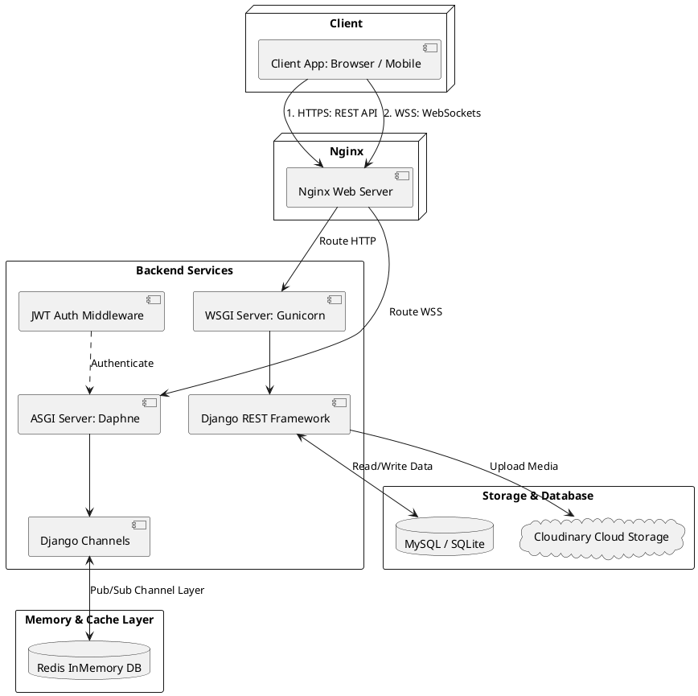
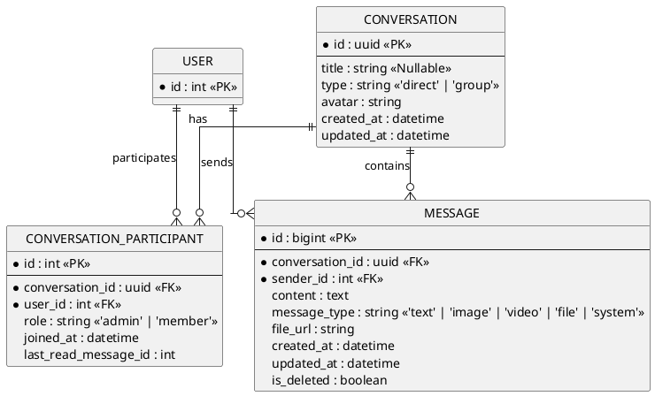

# LinkSphere - Real-time Social Network Backend API

[](https://www.djangoproject.com/)
[](https://www.django-rest-framework.org/)
[](https://www.python.org/)
[](https://github.com/django/daphne)
[](https://pytest.org/)
[](https://opensource.org/licenses/MIT)

**LinkSphere** is a high-performance backend API for a mini social network that enables users to connect, share posts, interact in real-time, and chat instantly. The system is designed with a highly modular architecture, splitting core features into standalone Django applications within the `apps/` directory, and seamlessly combining RESTful APIs with bi-directional WebSockets (ASGI).

---

## 📌 Table of Contents

- [⚡ Core Features](#-core-features)
- [🏗️ System Architecture & Tech Stack](#️-system-architecture--tech-stack)
- [💾 Database Schema Design](#-database-schema-design)
- [⚡ Standardized API Response Format](#-standardized-api-response-format)
- [🛠️ Local Setup & Installation Guide](#️-local-setup--installation-guide)
- [🧪 Running the Test Suite](#-running-the-test-suite)
- [📡 WebSockets Chat Protocol Specification](#-websockets-chat-protocol-specification)
- [🤝 Contribution & License](#-contribution--license)

---

## ⚡ Core Features

The system is highly modularized, with core apps located in the `apps/` folder:

- **Authentication & Users (`apps.users`)**: Registration, secure login utilizing **JWT (Access & Refresh Tokens)**, viewing/updating profiles, and Follow / Unfollow functionality.
- **Posts (`apps.posts`)**: Creating new posts with cloud-based image uploads, newsfeed post retrieval, and post Liking / Unliking.
- **Comments (`apps.comments`)**: Multi-level commenting system on posts.
- **Feeds (`apps.feed`)**:
  - `Feed`: Displays posts only from users that the current user follows (sorted chronologically).
  - `Explore`: Displays all public posts for content discovery.
- **Notifications (`apps.notifications`)**: Automatically triggers real-time one-way push notifications (via WebSockets) on user interactions (likes, comments, new follows). Supports marking notifications as read.
- **Search (`apps.search`)**: Intelligent querying for both Users and Posts.
- **Real-time Chat (`apps.chat`)**:
  - Trò chuyện 1-đối-1 (Direct Chat) and Group Chats.
  - Automatic lookup and reuse of existing direct chat rooms to optimize resources.
  - **WebSockets Real-time**: Instant message delivery, typing indicators, and read receipts.
  - **Cursor-based Pagination** for message history retrieval to prevent duplicate entries when scrolling.
  - Uploading image/video/file attachments directly to **Cloudinary CDN** via dedicated APIs.

---

## 🏗️ System Architecture & Tech Stack



### Core Technologies:

- **Backend Framework:** Django & Django REST Framework (DRF).
- **Real-time Engine:** Django Channels, running under the Daphne ASGI Server.
- **Channel Layer:** **Redis** (`channels_redis`) acting as the message broker for asynchronous socket distribution.
- **Cloud Integrations:**
  - **Cloudinary Storage:** Securely stores and serves avatars and post images via CDN.
  - **Resend API:** Handles automated welcome and verification emails during registration.
- **Testing:** Pytest & Pytest-Django to automate local test execution.

---

## 💾 Database Schema Design

To support group chats and optimize query performance, the chat schema is structured as follows:



> [!TIP]
> **Database Index Optimization:**
>
> - **Composite Index** on `CONVERSATION_PARTICIPANT` for `(user_id, conversation_id)` allows fast access validation when connecting or sending messages.
> - **Composite Index** on `MESSAGE` for `(conversation_id, id)` optimizes the Cursor-based pagination query to retrieve sorted messages descendingly without performing memory-intensive sorts.

---

## ⚡ Standardized API Response Format

All responses returned from the Backend API are standardized to maintain a uniform structure for Frontend integration:

### Success Response

```json
{
  "success": true,
  "message": "Create direct chat successfully.",
  "data": {
    "id": "a0831845-43b5-4f43-b19b-ebecc3081bf1",
    "title": "testuser",
    "type": "direct",
    "avatar": null,
    "created_at": "2026-05-31T03:00:00Z",
    "updated_at": "2026-05-31T03:41:18Z",
    "last_message": null,
    "unread_count": 0,
    "other_participant": {
      "id": 2,
      "username": "testuser",
      "email": "test@gmail.com",
      "avatar": null
    }
  },
  "timestamp": "2026-05-31T03:41:19Z"
}
```

### Error Response

```json
{
  "success": false,
  "message": "Recipient not found.",
  "errors": [],
  "errorCode": "RECIPIENT_NOT_FOUND",
  "timestamp": "2026-05-31T03:42:00Z"
}
```

---

## 🛠️ Local Setup & Installation Guide

### System Requirements:

- Python 3.11 or higher.
- Redis server running on the default port `6379`.

### Installation Steps:

1.  **Clone the Repository:**

    ```bash
    git clone <url-repository>
    cd link-sphere
    ```

2.  **Create and Activate a Virtual Environment:**

    ```bash
    python -m venv .venv
    # Windows:
    .venv\Scripts\activate
    # macOS/Linux:
    source .venv/bin/activate
    ```

3.  **Install the Required Dependencies:**

    ```bash
    pip install -r requirements.txt
    ```

4.  **Configure Environment Variables (`.env`):**
    Create a `.env` file at the project root and fill in your configurations:

    ```env
    SECRET_KEY=your-django-secret-key
    CLOUDINARY_CLOUD_NAME=your-cloud-name
    CLOUDINARY_API_KEY=your-api-key
    CLOUDINARY_API_SECRET=your-api-secret
    RESEND_API_KEY=your-resend-api-key
    ```

5.  **Run Migrations:**

    ```bash
    python manage.py makemigrations
    python manage.py migrate
    ```

6.  **Start the Real-time Daphne ASGI Server:**
    ```bash
    python manage.py runserver
    ```
    _Ensure you see `Starting ASGI development server...` in the terminal logs._

---

## 🧪 Running the Test Suite

LinkSphere utilizes **pytest** for thorough unit and integration testing. Run the entire test suite using:

```bash
pytest
```

All 28 tests (covering Authentication, Follows, Feeds, Posts, and Chat flows) will run:

```bash
Collected 28 items

apps/chat/tests.py ......                                                [ 21%]
apps/feed/tests.py ...                                                   [ 32%]
apps/posts/tests.py .........                                            [ 64%]
apps/users/tests.py ..........                                           [100%]

======================== 28 passed in 91.78s (0:01:31) ========================
```

---

## 📡 WebSockets Chat Protocol Specification

Establish a connection by completing a WebSocket handshake at:
`ws://127.0.0.1:8000/ws/chat/?token=<JWT_ACCESS_TOKEN>`

### 1. Sending a New Message (Client -> Server)

**Action:** `send_message`

```json
{
  "action": "send_message",
  "conversation_id": "a0831845-43b5-4f43-b19b-ebecc3081bf1",
  "content": "Hello everyone!",
  "message_type": "text",
  "file_url": null
}
```

### 2. Message Received Event (Server -> Client)

**Event:** `message_received`

```json
{
  "event": "message_received",
  "data": {
    "id": 1,
    "conversation_id": "a0831845-43b5-4f43-b19b-ebecc3081bf1",
    "sender": {
      "id": 1,
      "username": "testuser",
      "avatar": null
    },
    "content": "Hello everyone!",
    "message_type": "text",
    "file_url": null,
    "created_at": "2026-05-31T03:41:18.974624+00:00"
  }
}
```

### 3. Typing Indicator (Client -> Server -> Client)

**Send typing status:**

```json
{
  "action": "typing",
  "conversation_id": "a0831845-43b5-4f43-b19b-ebecc3081bf1",
  "is_typing": true
}
```

### 4. Read Message Notification (Client -> Server -> Client)

**Send read receipt:**

```json
{
  "action": "read_messages",
  "conversation_id": "a0831845-43b5-4f43-b19b-ebecc3081bf1",
  "message_id": 1
}
```

---

## 🤝 Contribution & License

- Distributed under the **MIT License**.
- Contributions are welcome! Please feel free to open a Pull Request or submit an Issue directly in the repository.
- **Authors:** LinkSphere Development Team 🌐
