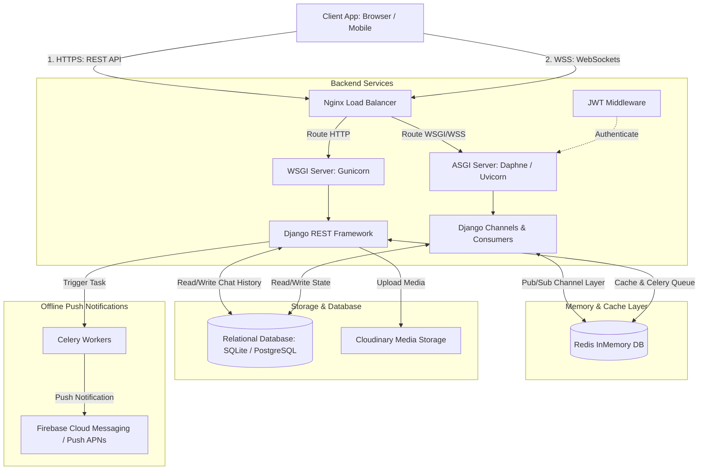
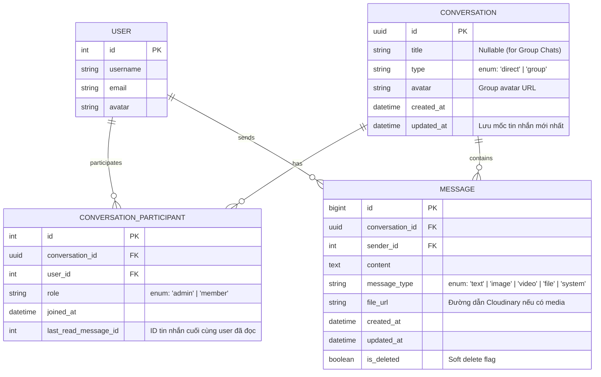
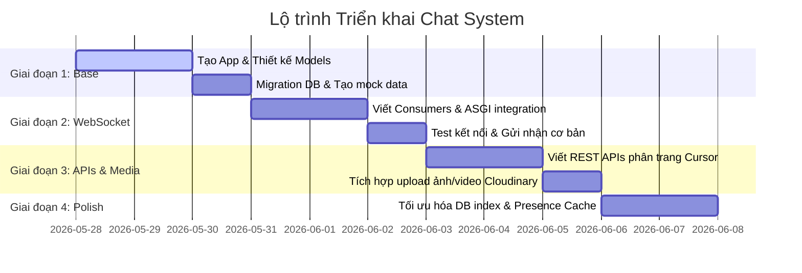

# Thiết Kế Hệ Thống Chat Real-Time (High-Level System Design) - LinkSphere

Tài liệu này trình bày thiết kế kiến trúc hệ thống Chat thời gian thực (Real-time Chat System) cho mạng xã hội **LinkSphere**, tích hợp trực tiếp vào cấu trúc hiện tại của dự án (Django, Django REST Framework, Django Channels, Redis và Cloudinary).

---

## 1. Tổng Quan Kiến Trúc (System Architecture)

Hệ thống Chat của LinkSphere kết hợp cả hai cơ chế giao tiếp:
*   **HTTP REST APIs (DRF):** Cho các thao tác phi đồng bộ như tạo cuộc hội thoại, lấy lịch sử tin nhắn (pagination), upload file phương tiện lên Cloudinary, chỉnh sửa/xóa tin nhắn.
*   **WebSockets (Django Channels):** Cho các luồng tương tác thời gian thực như gửi/nhận tin nhắn tức thì, trạng thái đang nhập chữ (*typing indicators*), trạng thái đã đọc (*read receipts*) và trạng thái trực tuyến (*online/offline status*).

### Sơ đồ kiến trúc luồng dữ liệu (Mermaid Diagram)



---

## 2. Thiết Kế Cơ Sở Dữ Liệu (Database Schema)

Để hỗ trợ cả chat **1-đối-1 (Direct Messages)** và **Chat Nhóm (Group Chats)** có nhiều thành viên, cơ sở dữ liệu được thiết kế tối ưu hóa cho các truy vấn lấy danh sách cuộc hội thoại và phân trang tin nhắn.

### Sơ đồ Quan hệ Thực thể (ERD)



> [!TIP]
> **Đánh chỉ mục (Index Optimization):**
> *   Đặt Composite Index trên bảng `CONVERSATION_PARTICIPANT` ở cặp `(user_id, conversation_id)` để kiểm tra nhanh quyền truy cập phòng chat.
> *   Đặt Index trên bảng `MESSAGE` ở cặp `(conversation_id, created_at)` để tối ưu hóa việc phân trang lấy lịch sử tin nhắn của cuộc trò chuyện theo thứ tự thời gian giảm dần.

---

## 3. Giao Thức WebSocket (WebSocket Protocol & Payload Schema)

Khi Client thiết lập kết nối tới Django Channels qua endpoint:
`wss://domain.com/ws/chat/?token=<JWT_ACCESS_TOKEN>`

`JWTAuthMiddleware` (đã có sẵn trong dự án) sẽ tự động giải mã token và gán User vào `scope['user']`. Nếu token không hợp lệ hoặc hết hạn, kết nối sẽ bị từ chối ngay lập tức.

Dưới đây là đặc tả chi tiết định dạng JSON payload được truyền qua WebSocket:

### 3.1. Gửi Tin Nhắn (Client gửi -> Server nhận)
**Action:** `send_message`
```json
{
  "action": "send_message",
  "conversation_id": "8f8b89d2-b0cb-4654-8e31-d8a1ef960b72",
  "content": "Xin chào! Mình vừa nhận được thông tin dự án.",
  "message_type": "text",
  "file_url": null
}
```

### 3.2. Server Phát Tán Tin Nhắn (Server gửi -> Tất cả Client trong phòng chat)
**Event:** `message_received`
```json
{
  "event": "message_received",
  "data": {
    "id": 10524,
    "conversation_id": "8f8b89d2-b0cb-4654-8e31-d8a1ef960b72",
    "sender": {
      "id": 15,
      "username": "hoangdinhbui",
      "avatar": "https://res.cloudinary.com/..."
    },
    "content": "Xin chào! Mình vừa nhận được thông tin dự án.",
    "message_type": "text",
    "file_url": null,
    "created_at": "2026-05-28T18:42:00Z"
  }
}
```

### 3.3. Trạng Thái Đang Nhập Chữ (Typing Indicator)
**Client gửi khi gõ phím:**
```json
{
  "action": "typing",
  "conversation_id": "8f8b89d2-b0cb-4654-8e31-d8a1ef960b72",
  "is_typing": true
}
```
**Server phát tán tới những người khác:**
```json
{
  "event": "user_typing",
  "data": {
    "conversation_id": "8f8b89d2-b0cb-4654-8e31-d8a1ef960b72",
    "user_id": 15,
    "username": "hoangdinhbui",
    "is_typing": true
  }
}
```

### 3.4. Trạng Thái Đã Đọc (Read Receipt)
Khi người dùng mở phòng chat hoặc cuộn xuống xem tin nhắn mới:
**Client gửi:**
```json
{
  "action": "read_message",
  "conversation_id": "8f8b89d2-b0cb-4654-8e31-d8a1ef960b72",
  "message_id": 10524
}
```
**Server lưu vào DB và phát tán:**
```json
{
  "event": "message_read",
  "data": {
    "conversation_id": "8f8b89d2-b0cb-4654-8e31-d8a1ef960b72",
    "user_id": 15,
    "message_id": 10524,
    "read_at": "2026-05-28T18:42:15Z"
  }
}
```

---

## 4. Hướng Dẫn Triển Khai Chi Tiết (Implementation Blueprint)

### Bước 1: Khởi Tạo Django App Mới
Chạy lệnh khởi tạo ứng dụng `chat`:
```bash
python manage.py startapp chat
```
Di chuyển app vào thư mục `apps/` của dự án để đảm bảo tính gọn gàng như các module khác (`apps.users`, `apps.posts`,...). Đăng ký app mới này vào danh sách `INSTALLED_APPS` trong [base.py](file:///d:/UTC2/link-sphere/config/settings/base.py#L37):
```python
INSTALLED_APPS = [
    # ...
    'apps.chat',
]
```

### Bước 2: Định Nghĩa Các Models trong `apps/chat/models.py`
Xây dựng lớp `Conversation`, `ConversationParticipant`, và `Message` kế thừa trực tiếp cấu trúc từ Django `models.Model`.

```python
import uuid
from django.db import models
from django.conf import settings

class Conversation(models.Model):
    id = models.UUIDField(primary_key=True, default=uuid.uuid4, editable=False)
    title = models.CharField(max_length=255, blank=True, null=True) # Chỉ bắt buộc cho Group Chat
    type = models.CharField(
        max_length=10,
        choices=[('direct', 'Direct'), ('group', 'Group')],
        default='direct'
    )
    avatar = models.ImageField(upload_to='chat_group_avatars/', blank=True, null=True)
    created_at = models.DateTimeField(auto_now_add=True)
    updated_at = models.DateTimeField(auto_now=True)

    def __str__(self):
        return f"{self.type} - {self.title or self.id}"

class ConversationParticipant(models.Model):
    conversation = models.ForeignKey(Conversation, on_delete=models.CASCADE, related_name='participants')
    user = models.ForeignKey(settings.AUTH_USER_MODEL, on_delete=models.CASCADE, related_name='chat_participations')
    role = models.CharField(
        max_length=10,
        choices=[('admin', 'Admin'), ('member', 'Member')],
        default='member'
    )
    joined_at = models.DateTimeField(auto_now_add=True)
    last_read_message_id = models.BigIntegerField(null=True, blank=True)

    class Meta:
        unique_together = ('conversation', 'user')

class Message(models.Model):
    conversation = models.ForeignKey(Conversation, on_delete=models.CASCADE, related_name='messages')
    sender = models.ForeignKey(settings.AUTH_USER_MODEL, on_delete=models.CASCADE, related_name='sent_messages')
    content = models.TextField(blank=True, null=True)
    message_type = models.CharField(
        max_length=10,
        choices=[
            ('text', 'Text'),
            ('image', 'Image'),
            ('video', 'Video'),
            ('file', 'File'),
            ('system', 'System')
        ],
        default='text'
    )
    file_url = models.URLField(max_length=500, blank=True, null=True) # URL ảnh/video/file từ Cloudinary
    created_at = models.DateTimeField(auto_now_add=True)
    updated_at = models.DateTimeField(auto_now=True)
    is_deleted = models.BooleanField(default=False)

    class Meta:
        ordering = ['created_at']

    def __str__(self):
        return f"Msg {self.id} by {self.sender.username}"
```

### Bước 3: Cấu Hình WebSocket Routing và Consumer
Tạo file `apps/chat/routing.py` để khai báo websocket URL pattern cho module chat:
```python
# apps/chat/routing.py
from django.urls import path
from . import consumers

websocket_urlpatterns = [
    path('ws/chat/', consumers.ChatConsumer.as_asgi()),
]
```

Tích hợp routing này vào [asgi.py](file:///d:/UTC2/link-sphere/config/asgi.py) chính của dự án bằng cách hợp nhất `websocket_urlpatterns` của `chat` và `notifications`:
```python
# config/asgi.py
from apps.notifications.routing import websocket_urlpatterns as notification_urls
from apps.chat.routing import websocket_urlpatterns as chat_urls

combined_websocket_urlpatterns = notification_urls + chat_urls

application = ProtocolTypeRouter({
    'http': get_asgi_application(),
    'websocket': JWTAuthMiddleware(
        URLRouter(combined_websocket_urlpatterns)
    ),
})
```

### Bước 4: Viết Lớp `ChatConsumer` Xử Lý Logic Real-time
Consumer kế thừa `AsyncWebsocketConsumer` để tối đa hóa hiệu năng phi đồng bộ, tránh chặn thread (non-blocking IO).

```python
# apps/chat/consumers.py
import json
from channels.generic.websocket import AsyncWebsocketConsumer
from channels.db import database_sync_to_async
from django.core.exceptions import ObjectDoesNotExist
from apps.chat.models import Conversation, ConversationParticipant, Message
from apps.users.models import User

class ChatConsumer(AsyncWebsocketConsumer):
    async def connect(self):
        self.user = self.scope['user']
        if self.user.is_anonymous:
            await self.close(code=4001) # 4001: Unauthorized
            return

        # Mỗi user khi connect sẽ join vào một "user-specific" group để nhận tin nhắn từ mọi phòng chat
        self.user_group = f"user_{self.user.id}"
        await self.channel_layer.group_add(self.user_group, self.channel_name)
        await self.accept()

    async def disconnect(self, close_code):
        if hasattr(self, 'user_group'):
            await self.channel_layer.group_discard(self.user_group, self.channel_name)

    async def receive(self, text_data):
        try:
            data = json.loads(text_data)
            action = data.get('action')
            conversation_id = data.get('conversation_id')

            # Kiểm tra quyền truy cập vào phòng chat
            is_member = await self.is_conversation_member(self.user, conversation_id)
            if not is_member:
                await self.send(text_data=json.dumps({'error': 'Bạn không có quyền trong cuộc hội thoại này'}))
                return

            if action == 'send_message':
                await self.handle_send_message(data)
            elif action == 'typing':
                await self.handle_typing(data)
            elif action == 'read_message':
                await self.handle_read_message(data)

        except Exception as e:
            await self.send(text_data=json.dumps({'error': str(e)}))

    async def handle_send_message(self, data):
        conversation_id = data.get('conversation_id')
        content = data.get('content', '')
        message_type = data.get('message_type', 'text')
        file_url = data.get('file_url')

        # 1. Lưu tin nhắn vào DB dưới dạng async
        msg = await self.save_message(conversation_id, self.user, content, message_type, file_url)
        
        # 2. Lấy danh sách thành viên để phát tin nhắn
        participants = await self.get_conversation_participants(conversation_id)

        # 3. Gửi tin nhắn real-time tới tất cả các thành viên đang kết nối
        payload = {
            'type': 'chat_message', # Tên hàm sẽ được gọi (chat_message)
            'event': 'message_received',
            'data': {
                'id': msg.id,
                'conversation_id': conversation_id,
                'sender': {
                    'id': self.user.id,
                    'username': self.user.username,
                    'avatar': self.user.avatar.url if self.user.avatar else None
                },
                'content': msg.content,
                'message_type': msg.message_type,
                'file_url': msg.file_url,
                'created_at': msg.created_at.isoformat()
            }
        }

        for user_id in participants:
            # Gửi tới kênh cá nhân của từng thành viên
            await self.channel_layer.group_send(f"user_{user_id}", payload)

    async def chat_message(self, event):
        # Hàm callback của Channels gửi payload về client qua WebSocket
        await self.send(text_data=json.dumps({
            'event': event['event'],
            'data': event['data']
        }))

    async def handle_typing(self, data):
        conversation_id = data.get('conversation_id')
        is_typing = data.get('is_typing', False)
        participants = await self.get_conversation_participants(conversation_id)

        payload = {
            'type': 'chat_message',
            'event': 'user_typing',
            'data': {
                'conversation_id': conversation_id,
                'user_id': self.user.id,
                'username': self.user.username,
                'is_typing': is_typing
            }
        }

        for user_id in participants:
            if user_id != self.user.id: # Không gửi lại cho chính người đang gõ
                await self.channel_layer.group_send(f"user_{user_id}", payload)

    async def handle_read_message(self, data):
        conversation_id = data.get('conversation_id')
        message_id = data.get('message_id')

        # Cập nhật mốc tin nhắn đã đọc cuối cùng vào DB
        await self.update_last_read(conversation_id, self.user, message_id)
        participants = await self.get_conversation_participants(conversation_id)

        payload = {
            'type': 'chat_message',
            'event': 'message_read',
            'data': {
                'conversation_id': conversation_id,
                'user_id': self.user.id,
                'message_id': message_id
            }
        }

        for user_id in participants:
            await self.channel_layer.group_send(f"user_{user_id}", payload)

    # --- Các hàm thao tác cơ sở dữ liệu phi đồng bộ (Asynchronous DB Utilities) ---
    @database_sync_to_async
    def is_conversation_member(self, user, conversation_id):
        return ConversationParticipant.objects.filter(conversation_id=conversation_id, user=user).exists()

    @database_sync_to_async
    def get_conversation_participants(self, conversation_id):
        return list(ConversationParticipant.objects.filter(conversation_id=conversation_id).values_list('user_id', flat=True))

    @database_sync_to_async
    def save_message(self, conversation_id, sender, content, message_type, file_url):
        conv = Conversation.objects.get(id=conversation_id)
        msg = Message.objects.create(
            conversation=conv,
            sender=sender,
            content=content,
            message_type=message_type,
            file_url=file_url
        )
        # Cập nhật thời gian sửa đổi gần nhất của cuộc hội thoại để đưa lên đầu danh sách chat
        conv.save()
        return msg

    @database_sync_to_async
    def update_last_read(self, conversation_id, user, message_id):
        ConversationParticipant.objects.filter(
            conversation_id=conversation_id,
            user=user
        ).update(last_read_message_id=message_id)
```

### Bước 5: Xây Dựng REST APIs (Django REST Framework)
Dùng REST APIs để thực hiện các nghiệp vụ phi-realtime hoặc truy vấn dữ liệu tĩnh lớn:

1.  **POST `/api/chat/conversations/`**: Khởi tạo phòng chat. Nếu là chat direct, hệ thống sẽ kiểm tra xem đã tồn tại cuộc hội thoại nào giữa 2 người dùng chưa để tái sử dụng, tránh tạo trùng lặp.
2.  **GET `/api/chat/conversations/`**: Trả về danh sách các phòng chat hiện tại mà người dùng đang tham gia (được sắp xếp theo `updated_at` để hội thoại mới nhất luôn đưa lên đầu) kèm thông tin tin nhắn cuối cùng (*last message*) và số lượng tin nhắn chưa đọc (*unread count*).
3.  **GET `/api/chat/conversations/<uuid:id>/messages/`**: Trả về danh sách lịch sử tin nhắn của cuộc trò chuyện. Sử dụng **Cursor-based Pagination** thay vì Offset Pagination để ngăn chặn tình trạng trùng lặp hoặc mất tin nhắn khi tin nhắn mới liên tục được đẩy vào DB.
4.  **POST `/api/chat/media/upload/`**: Tải ảnh/video trò chuyện lên Cloudinary rồi nhận lại URL để truyền qua tin nhắn WebSocket.

---

## 5. Các Giải Pháp Tối Ưu Hiệu Năng & Độ Tin Cậy (Performance & Scalability)

Để hệ thống chat hoạt động trơn tru trong môi trường Producton với hàng ngàn người dùng đồng thời, cần lưu ý các vấn đề sau:

### 5.1. Phân Trang Dữ Liệu Bằng Cursor (Cursor-based Pagination)
Tránh sử dụng phân trang dạng `?page=2` (Offset) vì khi có tin nhắn mới gửi đến liên tục, các trang sẽ bị dịch chuyển khiến client load trang tiếp theo bị trùng tin nhắn cũ. 
*   **Giải pháp:** Phân trang dựa trên `id` hoặc `created_at` của tin nhắn cuối cùng client đang có. 
*   **Query mẫu:** `Message.objects.filter(conversation_id=cid, id__lt=last_seen_id).order_by('-id')[:50]`

### 5.2. Tối Ưu Hóa Kết Nối WebSockets & Connection Pooling
*   **Heartbeat/Ping-Pong:** Thiết lập cơ chế gửi gói tin trống (`ping` từ client, `pong` từ server hoặc ngược lại) định kỳ mỗi 30 giây để ngăn chặn bộ định tuyến hoặc tường lửa đóng kết nối WebSocket đang hoạt động ngầm (idle connection timeout).
*   **Auto Reconnection:** Ở Client-side (React/React Native/Vue), sử dụng thư viện quản lý kết nối tự động kết nối lại khi mất mạng, áp dụng thuật toán **Exponential Backoff** (tăng dần thời gian chờ giữa các lần thử lại) để tránh làm sập server do bão kết nối lại (*thundering herd problem*).

### 5.3. Sử Dụng Caching Cho Trạng Thái Trực Tuyến (Presence Cache)
*   Thay vì cập nhật trạng thái trực tuyến (*Online*) vào database mỗi giây (gây tắc nghẽn I/O), hãy lưu trữ trạng thái này trong **Redis Cache** với thời gian hết hạn (TTL) ngắn (~ 60s). Khi Client duy trì kết nối, gửi định kỳ tín hiệu "keep-alive" để gia hạn TTL trên Redis.

### 5.4. Đồng Bộ Với Thông Báo Đẩy (Offline Fallback Notifications)
Khi một tin nhắn mới được gửi qua WebSocket:
1.  Nếu người nhận không có kết nối WebSocket hoạt động (không tham gia nhóm `user_<id>` trong Redis), gửi thông tin thông qua ứng dụng thông báo hiện có (`apps.notifications`).
2.  Đẩy tác vụ xử lý gửi Firebase Cloud Message (FCM) vào hàng đợi **Celery** để gửi push notification trên thiết bị di động (iOS/Android), đảm bảo không làm tắc nghẽn luồng xử lý WebSockets chính.

---

## 6. Lộ Trình Triển Khai (Milestones & Verification Plan)

Để tích hợp Chat System một cách an toàn và có kiểm soát, chúng ta sẽ đi theo các bước sau:



### Các bước kiểm thử thủ công (Manual Verification Plan)
1.  **Kiểm tra kết nối và bảo mật:** Dùng công cụ (như Postman WebSocket hoặc Chrome Extension Simple WebSocket Client) để kết nối tới `ws://127.0.0.1:8000/ws/chat/`. Thử kết nối không có token (phải bị từ chối 4001) và có token hợp lệ (phải kết nối thành công và nhận payload chào mừng).
2.  **Kiểm tra gửi nhận tin nhắn:** Mở hai tab trình duyệt, đăng nhập với hai tài khoản khác nhau, cùng tham gia một phòng chat và gửi tin nhắn để kiểm tra tính năng cập nhật tức thời (Real-time sync).
3.  **Kiểm tra Media upload:** Gửi một ảnh qua API upload, lấy URL kết quả và gửi tin nhắn có chứa URL này qua WebSocket, đảm bảo giao diện hiển thị chính xác.
